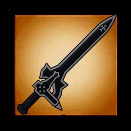

Kirito Sword

该 MOD 为饥荒联机版中的服务器 MOD.

原 MOD 地址为: [Kirito Sword](https://steamcommunity.com/sharedfiles/filedetails/?id=1157690027)

增加了 5 把 Kirito 的剑以及 3 个物品.

- 漆黑巨剑 (blackplate)

- 蓝蔷薇之剑 (bluerosesword)

- 逐暗者 (darkrepulsersword)

- 阐释者 (elucidatorsword)

- 夜空之剑 (nightskysword)

- 水晶石英铸块 (crystallite)

- 黑宝石 (elucidatorgem)

- 恶魔之树的顶枝 (gigascedar)

此版本仅作为自用, 并没有上传到创意工坊.

仅对原 MOD 进行了汉化, 修改了部分属性, 添加了星爆气流斩特性.

# 漆黑巨剑

漆黑巨剑是 Kirito 在 ALO 初期所用的一把剑, 简单粗暴. 

(请原谅我的渣翻, 我实在不知道咋翻译 blackplate 好听😂)

- 基础攻击力: 60

- 攻击速度: 减少 20%

- 攻击距离: 增加 20%

- 使用耐久: 600

- 移动速度: 减少 5%

- 制作: <kbd>木炭</kbd> X 10, <kbd>木材</kbd> X 2, <kbd>燧石</kbd> X 10

# 蓝蔷薇之剑

蓝蔷薇之剑是尤吉欧的爱剑, 制作夜空之剑的恶魔之树就是这把剑砍倒的.

- 基础攻击力: 100

- 攻击速度: 增加 10%

- 攻击距离: 增加 20%

- 使用耐久: 1600

- 移动速度: 增加 10%

- 普通附带 20% 的冰冻效果.

- 武器完全支配术: 有 35% 的几率发动, 对周围 5 米的敌对生物造成 50% 的冰冻效果, 并附带 100 点伤害.

- 制作: <kbd>冰块</kbd> X 25, <kbd>寒冰护符</kbd> X 1

# 逐暗者

逐暗者是莉兹贝特倾注其爱意为 Kirito 所锻造的剑.

- 基础攻击力: 110

- 攻击速度: 增加 10%

- 攻击距离: 增加 20%

- 使用耐久: 1600

- 移动速度: 增加 25%

- 暴击几率 35%, 伤害 200%

- 星爆气流斩: 阐释者攻击后会给 "被攻击者" 添加一个暗印记, 此时使用逐暗者攻击可以触发暗印记, 造成 360 点额外伤害.

- 制作: <kbd>水晶石英铸块</kbd> X 1, <kbd>锤子</kbd> X 1, <kbd>噩梦燃料</kbd> X 8

# 水晶石英铸块

在寒冷的雪山中由龙炼化而成的材料.

- 无法合成

- 蚁狮 BOSS 必定掉落 1 个水晶石英铸块

# 阐释者

阐释者是艾因格朗特 50 层 BOSS 的专属掉落物. 因为 25, 50, 75 的 BOSS 异常强大, 因此其掉落物也是十分强悍.

- 基础攻击力: 120

- 攻击速度: 增加 25%

- 攻击距离: 增加 30%

- 使用耐久: 2400

- 移动速度: 增加 25%

- 暴击几率 35%, 伤害 200%

- 星爆气流斩: 逐暗者攻击后会给 "被攻击者" 添加一个光印记, 此时使用阐释者攻击可以触发光印记, 造成 360 点额外伤害.

- 制作: <kbd>黑宝石</kbd> X 2, <kbd>噩梦燃料</kbd> X 8

# 黑宝石

- 无法合成

- 蚁狮 BOSS 必定掉落 1 个黑宝石

# 夜空之剑

Kirito 在 Under World 中的爱剑, 由恶魔之树的顶枝制作而成.

- 基础攻击力: 110

- 攻击速度: 增加 10%

- 攻击距离: 增加 20%

- 使用耐久: 2000

- 移动速度: 增加 20%

- 武器完全支配术: 记忆吞噬, 对攻击的目标造成 360 点固定伤害 (不是额外伤害哦!), 冷却时间 5 秒.

- 制作: <kbd>恶魔之树的顶枝</kbd> X 1, <kbd>大理石</kbd> X 4, <kbd>噩梦燃料</kbd> X 8

# 恶魔之树的顶枝

基家斯西达被称为恶魔之树, 卢利特村的村民们世世代代砍伐了近 300 年也仅砍出了一个小缺口. 后来由蓝蔷薇之剑斩断, 其顶端的树枝做成了夜空之剑.

- 制作: 活木 X 10

# 蚁狮

新增掉落: 必定掉落 <kbd>黑宝石</kbd> X 1, <kbd>水晶石英铸块</kbd> X 1

# 克劳斯

- 新增掉落: 10% 掉落逐暗者

- 新增掉落: 10% 掉落蓝蔷薇之剑

- 新增掉落: 10% 掉落夜空之剑

- 新增掉落: 10% 掉落阐释者
